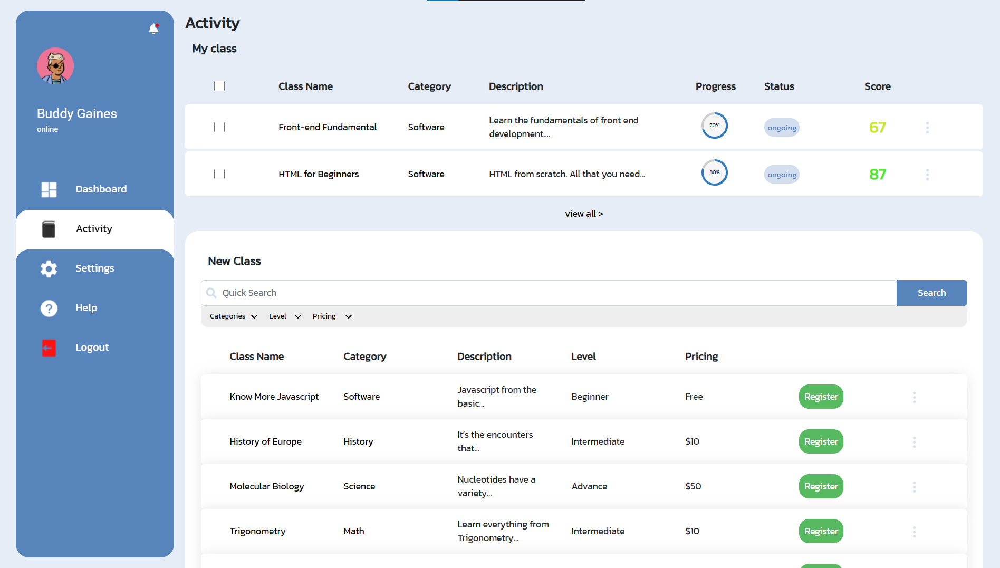

# Online Class React App

This is a Massive Open Online Course (MOOC) Site, which is an online course that is held on a large scale and is open with the aim of allowing unlimited participation that can be accessed via the web.

### Tech Stack

-   [React JS](https://reactjs.org/docs/create-a-new-react-app.html)
-   [HTML](https://developer.mozilla.org/en-US/docs/Web/HTML)
-   [CSS](https://developer.mozilla.org/en-US/docs/Web/CSS)
-   [Javascript](https://developer.mozilla.org/en-US/docs/Web/JavaScript)
-   [Bootstrap 5](https://getbootstrap.com/docs/5.0/getting-started/introduction/)

### Getting Started

You can view a live demo over at https://ahikmah-ocreact.netlify.app/

To get the frontend running locally

-   Clone this repository
-   `npm install` to install all required dependencies
-   `npm start` to start the local server

### Screenshot

Dashboard Page

Activity Page

Profile Page

Class Progress Page

